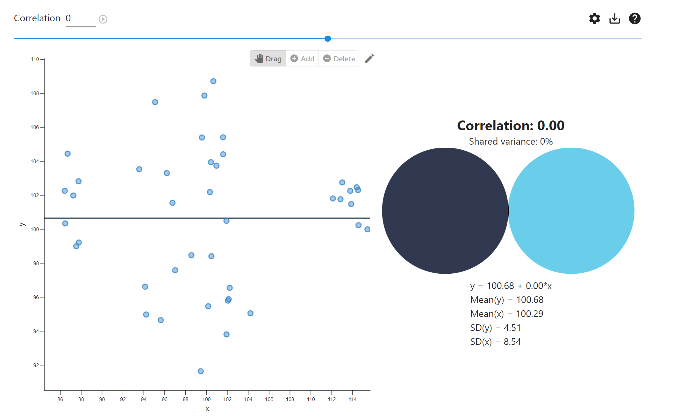

class: bg-main1

```{r setup, include=FALSE}
options(htmltools.dir.version = FALSE)
options(knitr.table.output = 'html')
library(knitr)
knitr::opts_chunk$set(warning = FALSE, message = FALSE, comment = '')
# options(knitr.table.format = "html")

```

## El instructor de este curso

.pull-left[


]

.pull-right[

Carlos J. Gómez
<br>

<i class="fab fa-r-project"></i> useR desde 2004<br><br>
Gestor de Calidad de Billetes & Monedas 
<br>
Banco Central de Chile
<br>


.typed[]
]
---

## .right[`r emo::ji("hammer_and_wrench")` Objetivo]

<br>

.large[
El alumno será capaz de aplicar métodos estadísticos *modernos* en distintos
problemas de la química analítica implementando las ténicas en lenguaje R. 
Desarrollará el pensamiento estadístico crítico para evaluar información
cuantittiva en ciencias de las mediciones.
]


---

## ¿Qué veremos en la clase "presencial" online?

1. Introducción al lenguaje de programación <i class="fab fa-r-project"></i>
2. Métodos de simulación
3. Investigación reproducible usando `rmarkdown`
4. Análisis exploratorio de datos 
5. Análisis de varianza (Estudios r&R)
6. Calibración lineal


---

class: inverse middle

# ¿Por qué `R`?

---

## ¿Por qué `R`?

- lenguaje de programación *para estadística creado por estadísticos*
- potenciado con más de 15,000 paquetes y librerías
- `metRology`, `chemCal`, etc.
- es el idioma *de facto* de la estadística y data science
- ¡es gratis! (*open source*)


---
class: center middle inverse

# ¿Qué es la investigación reproducible?

---
## Análisis estadístico "no reproducible (*aka* a mano)":


<br>
https://campus.sagepub.com/blog/why-teach-using-rmarkdown

---
## Investigación reproducible con RStudio y `rmarkdown` :


```{r, echo = F, out.width='30%'}

```


<br>
.footer[
- https://hbctraining.github.io/reproducibility-tools/lessons/01-Rmarkdown_basics.html
- https://book.fosteropenscience.eu/en/
]


---
class: center


---

class: center middle inverse

# Introducción a `R`

---
class: center middle inverse

# ¿Instaló R y Rstudio?

---
# ¿Por qué RStudio?
<br>
.pull-left[

]

.pull-right[
1. IDE (Entorno de desarrollo integrado)
2. Permite un desarrollo bajo el concepto de "**Investigación Reproducible**"
3. ¡Completamente gratis!
]


---
class: center middle inverse
# Iniciemos
<br>


---
## R es una calculadora

```{r, echo = T}
2 + 2
```

---
### R nos permite asignar un valor a una variable y almacenarla

Por ejemplo: asignemos a la variable x el valor 5

```{r, echo = T}
x <- 5
x

2*x
```
 El símbolo `<-` corresponde al operador asignación
 
---
## Operador concatenación `c()`:

```{r}
concentracion <- c(0, 10, 20, 30, 40, 50)
concentracion

metodo <- c('icpms', 'faas', 'hplc', 'gc')
metodo
```

---
## Operador de repetición y autollenado

```{r}
concentracion <- seq(0, 50, by = 10)

# Repetir la secuencia (icpms, faas) 5 veces
metodo <- rep(c('icpms', 'faas'), 5)
metodo

# Repetir cada método 5 veces cada uno. Primero icpms, luego faas
metodo <- rep(c('icpms', 'faas'), each = 5)
metodo

```


---
## El `data.frame` es la estructura 2D regular básica de datos (similar a hoja Excel):

```{r}
# Crearemos un data frame de 2 columnas: Método Analítico y Concentración
# Primero creamos la variable Metodo (sin acento)

metodo <- rep(c('ICPMS', 'FAAS'), each = 10)
concentracion <- rep(c(10, 20), each = 10)

# Creamos el data.frame en base a las variables metodo y concentracion y los
# guardamos con el nombre datos:

datos <- data.frame(metodo, concentracion)
datos
```

---
## Seleccionar con el signo $ una única variable desde un `data.frame`:

```{r}
# Seleccionemos sólo la concentración del data.frame datos
datos$concentracion
```


---
class: center middle inverse

# Simulación de datos aleatorios

---
## R posee varias herramientas para simulación aleatoria. Usaremos el comando `rnorm` para simular datos normales:


```{r}
# Guardaremos en x 100 datos aleatorios normales con media 120 y desviación
# estándar 10

x <- rnorm(100, 120, 10)

```

---
## Simulación de datos normales

```{r}
hist(x)
```


---
## Simulación de datos normales

```{r}
mean(x)
sd(x)
```


---
class: center middle inverse

# Análisis Exploratorio de Datos
## Crearemos un proyecto en RStudio
## `Curso Estadsitica 2021`

---
## ¿Cuál es el objetivo de la inferencia estadística?
<br>
<br>
.center[
```{r, echo = F, out.width='90%'}

```
]
<br>.footer[
Cortesía de https://github.com/walmes/Tikz
]


---
class: center middle inverse

# Importar datos desde Excel

---
## Instalamos la librería `readxl`:

```{r, eval = F}
install.packages('readxl')
```

---
## Importaremos la hoja `EDA` del archivo `datos_curso.xlsx`:

```{r}
library(readxl) # Cargamos la librería
eda <- read_excel('datos_curso.xlsx', sheet = 'EDA')
head(eda) # es un data frame (similar a una matriz de datos en Excel)
```


---
class: center middle inverse

# Gráficos con el package `ggplot2`

---
## Instalamos la librería `ggplot2`:

```{r, eval = F}
install.packages(ggplot2) # se instala una única vez en el documento
```

---
## Cargamos la librería `ggplot2`:

```{r}
library(ggplot2) #se carga una sola vez en el documento
```

---
## Boxplot

.pull-left[
```{r, eval = F}
ggplot(eda, aes(x = Analista, y = Concentracion)) +
  geom_boxplot()
```
]
.pull-right[
```{r, eval = T, echo = F}
ggplot(eda, aes(x = Analista, y = Concentracion)) +
  geom_boxplot()
```
]

---
## Boxplot

.pull-left[
```{r, eval = F}
ggplot(eda, aes(x = Analista, y = Concentracion, fill = Analista)) +
  geom_boxplot() +
  ggtitle('Concentración de %Cu por analista') +
  xlab('Analista') +
  ylab('Concentración % Cu') +
  theme_minimal()
  
```
]
.pull-right[
```{r, eval = T, echo = F}
ggplot(eda, aes(x = Analista, y = Concentracion, fill = Analista)) +
  geom_boxplot() +
  ggtitle('Concentración de %Cu por analista') +
  xlab('Analista') +
  ylab('Concentración % Cu') +
  theme_minimal()
```
]

---
## Histograma

.pull-left[
```{r, eval = F}
ggplot(eda, aes(x = Concentracion)) +
  geom_histogram(fill = 'blue') +
  theme_minimal()
```
]

.pull-right[
```{r, eval = T, echo = F}
ggplot(eda, aes(x = Concentracion)) +
  geom_histogram(fill = 'blue') +
  theme_minimal()
```
]

---
## Density plot

.pull-left[
```{r, eval = F}
ggplot(eda, aes(x = Concentracion)) +
  geom_density(fill = 'red') +
  xlim(23, 31) +
  theme_minimal()
```
]

.pull-right[
```{r, eval = T, echo = F}
ggplot(eda, aes(x = Concentracion)) +
  geom_density(fill = 'red') +
  xlim(23, 31) +
  theme_minimal()
```
]

---
class: center middle inverse
# ¿Cómo podría diferencias a los analistas?

---
## Density plot ¿Cómo podría diferenciar a los analistas?

.pull-left[
```{r, eval = F}
ggplot(eda, aes(x = Concentracion, fill = Analista)) +
  geom_density() +
  xlim(23, 31) +
  theme_minimal()
```
]

.pull-right[
```{r, eval = T, echo = F}
ggplot(eda, aes(x = Concentracion, fill = Analista)) +
  geom_density() +
  xlim(23, 31) +
  theme_minimal()
```
]

---
## Density plot ¿Cómo podría diferenciar a los analistas?

.pull-left[
```{r, eval = F}
ggplot(eda, aes(x = Concentracion, fill = Analista)) +
  geom_density(alpha = 0.3) +
  xlim(23, 31) +
  theme_minimal()
```
]

.pull-right[
```{r, eval = T, echo = F}
ggplot(eda, aes(x = Concentracion, fill = Analista)) +
  geom_density(alpha = 0.3) +
  xlim(23, 31) +
  theme_minimal()
```
]
---
## Density plot ¿Cómo podría diferenciar a los analistas?

.pull-left[
```{r, eval = F}
ggplot(eda, aes(x = Concentracion, fill = Analista, col = Analista)) +
  geom_density(alpha = 0.3) +
  xlim(23, 31) +
  theme_minimal()
```
]

.pull-right[
```{r, eval = T, echo = F}
ggplot(eda, aes(x = Concentracion, fill = Analista, col = Analista)) +
  geom_density(alpha = 0.3) +
  xlim(23, 31) +
  theme_minimal()
```
]

---
## QQ Plot de normalidad

.pull-left[
```{r, eval = F}
ggplot(eda, aes(sample = Concentracion)) +
  stat_qq() +
  stat_qq_line() +
  theme_minimal()
```
]

.pull-rigth[
```{r, eval = T, echo = F}
ggplot(eda, aes(sample = Concentracion)) +
  stat_qq() +
  stat_qq_line() +
  theme_minimal()
```
]

---
## Dotplot o strpchart: Cuando los datos son discretos (con pocos decimales) o instrumentos con poca resolución (balanza granataria vs analítica):

```{r}
# Importar la hoja Peso
peso <- read_excel('datos_curso.xlsx', sheet = 'Peso')
head(peso) 
```


---
## Analicemos la variable `Peso_original` obtenida con una balanza que posee una resolución de 0,001 g:

.pull-left[
```{r, eval = F, echo = T}
ggplot(peso, aes(y = Peso_baja_resolucion)) +
  geom_boxplot() +
  theme_minimal()
```
]

.pull-right[
```{r, eval = T, echo= F}
ggplot(peso, aes(y = Peso_baja_resolucion)) +
  geom_boxplot() +
  theme_minimal()
```
]

---
### Analicemos la variable `Peso_original` obtenida con una balanza que posee una resolución de 0,001 g:

.pull-left[
```{r, eval = F}
ggplot(peso, aes(sample = Peso_baja_resolucion)) +
  stat_qq() +
  stat_qq_line() +
  theme_minimal()
```
]

.pull-right[
```{r, eval = T, echo= F}
ggplot(peso, aes(sample = Peso_baja_resolucion)) +
  stat_qq() +
  stat_qq_line() +
  theme_minimal()
```
]

---
### Analicemos la variable `Peso_original` obtenida con una balanza que posee una resolución de 0,0001 g:

.pull-left[
```{r, eval = F}
ggplot(peso, aes(sample = Peso_alta_resolucion)) +
  stat_qq() +
  stat_qq_line() +
  theme_minimal()
```
]

.pull-right[
```{r, eval = T, echo= F}
ggplot(peso, aes(sample = Peso_alta_resolucion)) +
  stat_qq() +
  stat_qq_line() +
  theme_minimal()
```
]

---
## Con datos con baja resolución es mejor utilizar `dotPlot` de la librería `mosaic`:

.pull-left[
```{r, eval = F, echo = T}
library(mosaic) # Asumimos que ya se instaló con install.packages('mosaic')
dotPlot(~ Peso_baja_resolucion, data = peso)

```
]

.pull-right[
```{r, eval = T, echo = F}
library(mosaic) # Asumimos que ya se instaló con install.packages('mosaic')
dotPlot(~ Peso_baja_resolucion, data = peso)

```
]


---
## Estadística descriptiva con el package `mosaic`:
```{r}
favstats(Concentracion ~ Analista, data = eda)  

# Para calcular MAD usar mad()
mad(eda$Concentracion) # Con el signo $ seleccionamos uan de las variables del df
```


---
class: center middle inverse

# Intervalo de confianza para la media de datos normales
## ¿Cuál es la interpretación correcta?

---
## Intervalo de confianza para datos normales:


---
# Calcular el IC para una muestra `Normal`:


.pull-left[
```{r}
# Simularemos 20 datos normales con media 100 
# y desviación estándar 10
x.normal <- rnorm(20, 100, 10)
shapiro.test(x.normal)
```

```{r, eval = F}
datos.normales <- data.frame(x.normal)
ggplot(datos.normales, aes(sample = x.normal)) +
  stat_qq() +
  stat_qq_line() +
  theme_minimal() +
  ggtitle('QQ plot de normalidad')
```

]
.pull-right[
```{r, echo = F}
datos.normales <- data.frame(x.normal)
ggplot(datos.normales, aes(sample = x.normal)) +
  stat_qq() +
  stat_qq_line() +
  theme_minimal() +
  ggtitle('QQ plot de normalidad')
```
]

---
## En la práctica no conocemos la desviación estándar, por lo tanto, debemos utilizar:

$$\overline{x} \pm t_{n - 1, \alpha/2}\cdot\frac{s}{\sqrt{n}}$$
En `R` lo podríamos calcular "a mano":

```{r}
media <- mean(x.normal)
s <- sd(x.normal)
n <- length(x.normal) # Número de datos
alpha <- 0.05 
t <- qt(1 - alpha/2, n - 1)

ci.superior <- media + t*s/sqrt(n)
ci.inferior <- media - t*s/sqrt(n)

ic <- c(ci.inferior, ci.superior)
ic
```

---
## En la práctica no conocemos la desviación estándar, por lo tanto, debemos utilizar:

$$\overline{x} \pm t_{n - 1, \alpha/2}\cdot\frac{s}{\sqrt{n}}$$
O usar el comando del test T `t.test`:

```{r}
t.test(x.normal)
```

---
## En la práctica no conocemos la desviación estándar, por lo tanto, debemos utilizar:

$$\overline{x} \pm t_{n - 1, \alpha/2}\cdot\frac{s}{\sqrt{n}}$$
O usar el comando `ci` del package `gmodels`:

```{r}
library(gmodels) # Asumimos que está instalado con install.packages('gmodels')
ci(x.normal)
```


---
class: center middle inverse

# ¿Cómo se interpreta un intervalo de confianza? 
## (suponga 1 - $\alpha$ = 95%)

---
## https://rpsychologist.com/d3/ci/

.center[

]

---
## En un gráfico estático:

```{r, out.width='50%'}
library(mosaic)
set.seed(12364)
CIsim(n = 10, samples = 100, plot= 'draw', conf.level = 0.95)    
```


---
class: center middle inverse

# ¿Cuál es el problema de las pruebas de hipótesis y los *p-values*?

---
## Críticas a las pruebas de hipótesis

"What's wrong with [null hypothesis significance testing]? Well, among many other things, it does not tell us what we want to know, and we so much want to know what we want to know that, out of desperation, we nevertheless believe that it does!"

– Cohen (1994)
“… surely the most bone-headedly misguided procedure ever institutionalized in the rote training of science students"

– Rozeboom (1997)
“… despite the awesome pre-eminence this method has attained in our journals and textbooks of applied statistics, it is based upon a fundamental misunderstanding of the nature of rational inference, and is seldom if ever appropriate to the aims of scientific research”

– Rozeboom (1960)
“… an instance of a kind of essential mindlessness in the conduct of research" – Bakan (1966)

– Bakan (1966)
“Statistical significance testing retards the growth of scientific knowledge; it never makes a positive contribution”

– Schmidt and Hunter (1997)
“The textbooks are wrong. The teaching is wrong. The seminar you just attended is wrong. The most prestigious journal in your scientific field is wrong."

---
## Declaración oficial de la *American Statistical Association*:


---
## Críticas actuales en revistas internacionesl con alto ISI:


---
## Críticas actuales en revistas internacionesl con alto ISI:


---
## Críticas actuales en revistas internacionesl con alto ISI:


---
class: center middle inverse
# Cómo comparar 1 media (1 grupo) con un valor pre-especificado?

---
## Comparar 1 media con un valor pre-especificado


---
## Comparar la concentración de %Cu en una aleación cuya especificación es de $\mu_{0} = 92\%$

```{r}
# generaremos n = 10 datos normales cuya media sea 92% y desviación std 10
Cu <- rnorm(10, 92, 10)
Cu
```

- $H_{0} \,\, \mu = 92\%$
- $H_{0} \,\, \mu \neq 92\%$

---
### Comparar la concentración de %Cu en una aleación cuya especificación es de $\mu = 92\%$

.pull-left[
```{r, echo = F}
ggplot(as.data.frame(Cu), aes(y = Cu)) +
  geom_boxplot() +
  theme_minimal()
```
]

.pull-right[
```{r, echo = F}
ggplot(as.data.frame(Cu), aes(sample = Cu)) +
  stat_qq() +
  stat_qq_line() +
  theme_minimal()
```
]


---
## Test de Normalidad de Shapiro

```{r}
shapiro.test(Cu)
```

---
## test T para comparar una media con una especificación

```{r}
t.test(Cu, mu = 92)
```


---
## Errores que se pueden cometer en una prueba de significancia:

- Error tipo I: $H_{0}$ es verdadera pero "justo" tomamos una muestra tan extrema que rechazamos esta hipótesis. Esto ocurrirá un $\alpha$ % de las veces 

- Error tipo II: $H_{0}$ es falsa pero debido a la aleatoriedad del muestreo y precisión analítica no rechazamos esta hipótesis (¿El error "escondió" la diferencia?). Esto ocurrirá un $\beta$ % de las veces.


PD: La potencia estadística se define como *"la probabilidad de rechzar $H_{0}$
cuando ésta es falsa. Esto ocurrirá un $\1 \beta$ % de las veces.

---
class: center middle inverse

# ¿Cuáles "veces"?... 
# si llevamos a cabo el experimento ¡una única vez!

---
## Problemas con las pruebas de hipótesis y p-values

.pull-left[
1. No le dicen al científico lo que quiere saber
2. Significancia estadística no implica, necesariamente, significancia práctica
3. ¿Qué sucede en los casos límites? ¿p-value = 0,049999? ó ¿p-value = 0,050001?
]

.pull-right[

]

---
# Considerar siempre el error tipo I ó $\alpha$  (Falso descubrimiento):
```{r, out.width='50%', echo = F}

```


---
## La interpretación de una prueba de hipótesis dependerá de muchos factores:

.pull-left[
1. Tamaño de la muestra 
2. Tamaño del efecto "encontrado"
3. Precisión de las mediciones
4. Variabilidad entre-sujetos/muestras
5. Área de estudio
6. etc.
]

.pull-right[
```{r, out.width='60%', echo = F}

```
]

---
## El paradigma actual de las pruebas de hipótesis p-value < 0,05:

.pull.left[
- Las hipótesis nulas **NUNCA** de aceptan
- Sólo es posible rechazarlas o no
]

.pull-right[
```{r, out.width='90%', echo = F}

```
]
---
### Si el p-value > 0,05 $\implies$  **No existe evidencia en contra de $H_{0}$ lo que no quiere decir que sea cierta**

```{r, out.width='50%', echo = F}

```

---
class: center middle inverse

# Comparación de 2 medias : independientes o pareadas

---
### Comparación de 2 medias independientes $H_{0}: \mu_{1} = \mu_{2}$ vs $H_{1}: \mu_{1} \neq \mu_{2}$


---
class: center middle inverse

# Pensemos como Químicos 
# $H_{0}: \mu_{1} = \mu_{2}$ vs $H_{1}: \mu_{1} \neq \mu_{2}$

---
## Simularemos datos normales con $H_{0}$ "verdadera" y con la misma precisión:

```{r}
set.seed(123) # Es para que todos generemos los mismos números aleatorios
icpms <- rnorm(10, 100, 10)
faas <- rnorm(10, 100, 10)
```


---
## En primer lugar, confirmamos la normalidad de los datos:

```{r}
shapiro.test(icpms)
shapiro.test(faas)
```

---
## En rigor, en segundo lugar, se debiera comparar sus varianzas con el test F:

```{r}
var.test(icpms, faas)
```

Lo cual era esperado pues fueron simulados _homocedásticos_ (misma varianza/precisión)

---
## Test T para varianzas iguales

```{r}
t.test(icpms, faas)
```


---
## Simulemos el caso heterocedástico

```{r}
set.seed(226)
icpms <- rnorm(10, 100, 10) # Varianza = 10
faas <- rnorm(10, 100, 20) # Varianza = 20
```

---
## Normalidad con test de Shapiro-Wilk:

```{r}
shapiro.test(icpms)
shapiro.test(faas)
```

---
## Evaluamos la igualdad de varianzas con el test F

```{r}
var.test(icpms, faas)
```

... pues así fueron simuladas, es decir, con distinta precisión (varianza)

---
## Llevamos a cabo el test T para varianzas distintas

```{r}
t.test(icpms, faas, var.equal = F)
```
---
class: center middle inverse

# ¿Y si hubiesen sido muestras pareadas?

---
## Test T para muestras pareadas:


---
## Test T para muestras pareadas:


```{r}
t.test(icpms, faas, paired = T)
```


---
class: center middle inverse

# ¿Qué hacer con los datos anómalos (*outliers*)

---

.pull-left[
```{r, out.width = '100%', echo = F}

```
]
.pull.right[
- Si los eliminamos podríamos subestimar la verdadera precisión de un método analítico
- Si los dejamos podríamos sobrestimar la variabilidad de los datos y "esconder" diferencias químicamente relevantes
- etc.
]


---
## ¿Qué es un dato anómalo?

> Un dato anómalo (*outlier*) es un valor o una observación que está distante de las otras observaciones, es decir, que difiere significativamente de los otros datos. Enderlein va más allá y considera a los outliers como valores que están tan distantes de los otros, que se podría pensar que fueron generados por otro mecanismo. 

Antes de llevar a cabo un test de outliers es necesario verificar que el dato
es, desde el punto de vista químico, válido (Registros de medición y calibración, magnitudes físicas que influencias la medición, etc.)

---
## Ejemplo: importamos datos de % Cu en mineral hoja `outliers_1`:


```{r}
Cu.out <- read_excel('datos_curso.xlsx', sheet = 'outliers_1')
Cu.out
```

---
## Boxplot de % Cu en mineral

.pull-left[
```{r, eval = F}
ggplot(Cu.out, aes(y = Cu)) +
  geom_boxplot(fill = 'blue', col = 'blue', alpha = 0.5) +
  theme_minimal() +
  ylab('% Cu') +
  scale_x_discrete() # Elimina el eje X
```
Todos los valores fuera del siguiente intervalo son considerados como outliers:
$$I = [q_{0.25} - 1.5 \cdot IQR; q_{0.75} + 1.5 \cdot IQR]$$
]

.pull-right[
```{r, eval = T, echo = F}
ggplot(Cu.out, aes(y = Cu)) +
  geom_boxplot(fill = 'blue', col = 'blue', alpha = 0.4) +
  theme_minimal() +
  ylab('% Cu') +
  ylim(0.6, 1.4) +
  scale_x_discrete() # Elimina el eje X
```
]
---
## Test de Dixon con el package `outliers`:

```{r}
library(outliers)
dixon.test(Cu.out$Cu)
```

---
## Test de Grubbs con el package `outliers`:

```{r}
library(outliers)
grubbs.test(Cu.out$Cu)
favstats(Cu.out$Cu)

# El MAD debe calcularse con el comando mad()
mad(Cu.out$Cu)
```

---
## Ambos test asumen normalidad de los datos (incluyendo el dato sospechoso):

```{r}
shapiro.test(Cu.out$Cu) # Como Cu.out es un data frame debemos usar el signo $ para seleccionar la variable Cu
```

---
## Dos Criterios adicionales: Hampel y $Q_{n}$:

### Hampel $$I = [median - 3 \cdot MAD; median + 3 \cdot MAD]$$

### $Q_{n}$ $$I = [median - 3 \cdot Q_{n}; median + 3 \cdot Q_{n}]$$
<br>
<br>
<br>
.footer[
Rousseeuw, P.J. and Croux, C. (1993) Alternatives to the Median Absolute Deviation, Journal of the American Statistical Association *88*, 1273-1283.
]


---
## Criterio Hampel $$I = [median - 3 \cdot MAD; median + 3 \cdot MAD]$$

```{r}
c(median(Cu.out$Cu) - 3*mad(Cu.out$Cu), median(Cu.out$Cu) + 3*mad(Cu.out$Cu))
```

---
## Criterio $Q_{n}$ $$I = [median - 3 \cdot Q_{n}; median + 3 \cdot Q_{n}]$$

```{r}
library(robustbase)
c(median(Cu.out$Cu) - 3*Qn(Cu.out$Cu), median(Cu.out$Cu) + 3*Qn(Cu.out$Cu))
```

Conclusión: Se elimina el valor sospechoso

---
## Atención con los outliers pues podrían contener información valiosa

```{r, echo = F, out.width='40%'}

```


---
class: center middle inverse

# Análisis de datos NO Normales

---
## Estimar un intervalo de confianza para la media de las siguientes mediciones de As en pozos de agua `datos_no_normales`:

```{r}
datos.no.normales <- read_excel('datos_curso.xlsx', sheet = 'datos_no_normales')
datos.no.normales
```

---
## Boxplot

.pull-left[
```{r, eval = F}
ggplot(datos.no.normales, aes(y = As)) +
  geom_boxplot() +
  theme_minimal() +
  scale_x_discrete() # Elimina el eje X
```
]
.pull-right[
```{r, eval = T, echo = F}
ggplot(datos.no.normales, aes(y = As)) +
  geom_boxplot() +
  theme_minimal() +
  scale_x_discrete() # Elimina el eje X
```
]

---
## Histograma

.pull-left[
```{r, eval = F}
ggplot(datos.no.normales, aes(x = As)) +
  geom_histogram(col = 'red', fill = 'red', alpha = 0.5) +
  ggtitle('Histograma de As en agua de pozo [ppm]') +
  xlab('As [ppm]') +
  ylab('Cuentas') +
  theme_minimal()
```
]
.pull-right[
```{r, eval = T, echo = F}
ggplot(datos.no.normales, aes(x = As)) +
  geom_histogram(col = 'red', fill = 'red', alpha = 0.5) +
  ggtitle('Histograma de As en agua de pozo [ppm]') +
  xlab('As [ppm]') +
  ylab('Cuentas') +
  theme_minimal()
```
]

---
## QQ-Plot normalidad

.pull-left[
```{r, eval = F}
ggplot(datos.no.normales, aes(sample = As)) +
  stat_qq() +
  stat_qq_line() +
  theme_minimal()
```
]
.pull-right[
```{r, eval = T, echo = F}
ggplot(datos.no.normales, aes(sample = As)) +
  stat_qq() +
  stat_qq_line() +
  theme_minimal()
```
]

---
## Density plot

.pull-left[
```{r, eval = F}
ggplot(datos.no.normales, aes(x = As)) +
  geom_density(col = 'red', fill = 'red', alpha = 0.5) +
  theme_minimal()
```
]
.pull-right[
```{r, eval = T, echo = F}
ggplot(datos.no.normales, aes(x = As)) +
  geom_density(col = 'red', fill = 'red', alpha = 0.5) +
  theme_minimal()
```
]

---
## Test de normalidad de Shapiro

```{r}
shapiro.test(datos.no.normales$As)
```

---
## No podemos aplicar la fórmula de intervalo de confianza para la media de datos no normales:

$$\overline{x} \pm t_{n - 1, \alpha/2}\cdot\frac{s}{\sqrt{n}}$$
---
## Aplicaremos el método *bootstrap* con la librería `boot`:

```{r}
library(boot)

# Creamos la función que calculará la media de cada bootstrap
media.boot <- function(x, i) {
  mean(x[i])
}
```
---
# Aplicamos el comando `boot` sobre los datos de As y lo guardamos como `As.boot`:

```{r}
As.boot <- boot(datos.no.normales$As, media.boot, R = 1000)
As.boot
```

---
# Graficamos los promedios de las 1000 muestras bootstraps:

.center[
```{r}
plot(As.boot)
```
]

---
## Calculamos el intervalo de confianza para la media de As:

```{r}
boot.ci(As.boot)
```

---
## Bootstrap usando la librería `mosaic`:

```{r}
library(mosaic)
As.boot <- do(1000) * mean(~ As, data = resample(datos.no.normales))
```
---
## IC usando el comando `confint`:
```{r}
confint(As.boot, level = 0.95, method = "quantile")
```
---
## Intervalo de confianza para el coeficiente de variación:
```{r}
library(mosaic)
CV.As.boot <- do(1000) * mean(~ As, data = resample(datos.no.normales))/sd(~ As, data = resample(datos.no.normales))*100
confint(CV.As.boot, level = 0.95, method = "quantile")


```
---
class: center middle inverse

# ¿Cómo calcularía un intervalo de confianza para las concentraciones de Cloruro?


---
class: center middle inverse

# Test de permutaciones
## Para datos no normales

---
## ¿Qué hacer cuando no podemos aplicar el test T debido a no normalidad de los datos?

Ejemplo: Comparación de 2 métodos analíticos sobre la misma muestra.

```{r}
metodos.no.normales <- read_excel('datos_curso.xlsx', sheet = 'test_permutaciones')
metodos.no.normales
```


---
## Comparación ICPMS vs AAS datos no normales

.pull-left[
```{r, echo = F}
ggplot(metodos.no.normales %>% filter(Metodo == 'ICPMS'), 
       aes(sample = Concentracion)) +
  stat_qq() +
  stat_qq_line() +
  theme_minimal() +
  ggtitle('QQplot ICPMS')

```
]
.pull-right[
```{r, echo = F}
ggplot(metodos.no.normales %>% filter(Metodo == 'AAS'), 
       aes(sample = Concentracion)) +
  stat_qq() +
  stat_qq_line() +
  theme_minimal() +
  ggtitle('QQplot AAS')

```
]

---
## Comparación ICPMS vs AAS datos no normales con el package `exactRankTests`:

```{r}
library(exactRankTests)
perm.test(Concentracion ~ Metodo, exact = T, data = metodos.no.normales)
```

```{r}
t.test(Concentracion ~ Metodo, data = metodos.no.normales)
```

---
class: center middle inverse
# Test de Wilcoxon
## Para datos no normales

---
## Test de Wilcoxon para comparación de métodos ICPMS vs FAAS

```{r}
wilcox.test(Concentracion ~ Metodo, exact = T, data = metodos.no.normales)
```


---
class: center middle inverse

# Análisis de varianza
### Precisión de repetibilidad y "reproducibilidad" (ISO 5725)

---
## Modelo ANOVA:

$$y_{ij} = \mu + \alpha_{i} + \epsilon_{ij}$$

donde:

- $y$ es la respuesta a estudiar
- $\mu$ es la gran media
- $\alpha_{i}$ es el efecto del tratamiento $i$
- $\epsilon$ es un error aleatorio con media 0 y varianza constante

$$\begin{array}{ll}
H_0: & \mu_1 = \mu_2 = \ldots = \mu_I\\
H_a: & \mbox{Existen dos grupos al menos con medias distintas}
\end{array}$$

> permite comparar 3 ó mas medias

---
### Tetraciclinas en salmón por HPLC-MS/MS
*4 analistas llevan aplican el mismo SOP, el mismo día con el mismo instrumento*


---
## Transformar los datos del formato *wide* a *long* :


---
## Importamos los datos desde Excel a R:

```{r, echo = T}
library(readxl)
tetra <- read_excel('datos_curso.xlsx', 
                    sheet = 'anova_long')

tetra

```
---
## EDA


.pull-left[
```{r, eval = F}
library(ggplot2)
ggplot(tetra, aes(x = Analista, y = Concentracion)) +
  geom_boxplot() +
  theme_minimal()
```
]
.pull-right[
```{r, eval = T, echo = F}
library(ggplot2)
ggplot(tetra, aes(x = Analista, y = Concentracion)) +
  geom_boxplot() +
  theme_minimal()
```
]


---
class: center middle inverse

# ¿Existen diferencias entre los analistas?
---
## Anova de un factor

```{r}
anova.tetra <- aov(Concentracion ~ Analista, data = tetra)
summary(anova.tetra)
```

---
## Anova de un factor: Prueba de Tukey

```{r}
TukeyHSD(anova.tetra)
```

---
## Anova de un factor: Prueba de Tukey

```{r}
plot(TukeyHSD(anova.tetra))
```


---
## Estimar precisión a partir del ANOVA con el package `lme4`:

```{r}
library(lme4)
anova.repetibilidad <- lmer(Concentracion ~ (1|Analista), data = tetra)
anova.repetibilidad
```


---
class: center middle inverse

# ¿Qué sucede si los residuos del ANOVA no son normales?

---
## Comparación de 3 métodos analíticos

```{r}
metodos.no.normales2 <- read_excel('datos_curso.xlsx', sheet = 'anova_no_normal')
anova.no.normal <- aov(Concentracion ~ Metodo, data = metodos.no.normales2)
summary(anova.no.normal)
```


---
## Comparación de 3 métodos analíticos

```{r}
ggplot(metodos.no.normales2, aes(x = Metodo, y = Concentracion, fill = Metodo)) +
  geom_boxplot() +
  theme_minimal()
```

---
## Comparación de 3 métodos: Análisis de residuos

.pull-left[
```{r}
plot(anova.no.normal, which = 2)
```
]
.pull-right[
```{r}
shapiro.test(anova.no.normal$residuals)
```
]

---
## Test no parámetrico de Kruskal-Wallis:

```{r}
kruskal.test(Concentracion ~ Metodo, data = metodos.no.normales2)
```


---
class: center middle inverse

# ¿Cuál es la máxima diferencia permitida entre duplicados de análisis?

---
## Límite de repetibilidad (ISO 5725):

$$r = 2.8\cdot s_{r}$$

donde:

- $r$ es el límite de repetibiliad y corresponde a la máxima diferencia
tolerable, en valor absoluto, entre duplicados de análisis llevados
a cabo en condiciones de repetibilidad.
- $s_{r}$ es la desviación estándar de repetibilidad
- El factor 2.8 indica que este límite está construido con un 95% de confianza

---
## Duplicados de análisis de %Cu en concentrado de Cu:

```{r}
duplicados <- read_excel('datos_curso.xlsx', sheet = 'duplicados_wide')
duplicados

```

---
## Duplicados de análisis de %Cu en concentrado de Cu:

.pull-left[
```{r, eval = F}
ggplot(duplicados, aes(x = dup1, y = dup2)) +
  geom_point() +
  geom_smooth(method = 'lm', se = F) +
  xlab('Duplicado 1 [% Cu]') +
  ylab('Duplicado 2 [% Cu]') +
  theme_minimal()
```
]
.pull-right[
```{r, eval = T, echo = F}
ggplot(duplicados, aes(x = dup1, y = dup2)) +
  geom_point() +
  geom_smooth(method = 'lm', se = F) +
  xlab('Duplicado 1 [% Cu]') +
  ylab('Duplicado 2 [% Cu]') +
  theme_minimal()
```
]


---
## Duplicados de análisis de %Cu en concentrado de Cu por `Analista`
.pull-left[
```{r, eval = F}
ggplot(duplicados, aes(x = dup1, y = dup2)) +
  geom_point(aes(col = Analista)) +
  geom_smooth(method = 'lm', se = F) +
  xlab('Duplicado 1 [% Cu]') +
  ylab('Duplicado 2 [% Cu]') +
  theme_minimal()
```
]
.pull-right[
```{r, eval = T, echo = F}
ggplot(duplicados, aes(x = dup1, y = dup2)) +
  geom_point(aes(col = Analista)) +
  geom_smooth(method = 'lm', se = F) +
  xlab('Duplicado 1 [% Cu]') +
  ylab('Duplicado 2 [% Cu]') +
  theme_minimal()
```
]

---
## Cálculo de s de repetibilidad usando ANOVA $\implies$ Formato long

```{r}
duplicados.long <- read_excel('datos_curso.xlsx', sheet = 'duplicados_long')
duplicados.long
```

---
## Cálculo de s de repetibilidad usando ANOVA $\implies$ Formato long


```{r, eval = T}
library(lme4)
anova.repetibilidad <- lmer(Concentracion ~ (1|ID), data = duplicados.long)
anova.repetibilidad
```


---
class: center middle inverse

# Calibración lineal

---
## Modelo lineal de calibración:

$$y = \beta_{0} + \beta_{1}x + \epsilon$$
donde:
- $y$ es la respuesta instrumental (área, absorbancia, mV, etc.)
- $\beta_{0}$ es el intercepto (¿Concentración = 0?)
- $\beta_{1}$ es la pendiente de la curva de calibración (*sensibilidad*)
- $\epsilon$ es un error aleatorio Normal con media 0 y varianza constante $\sigma^{2}$

Por ejemplo: Ecuación de Lambert-Beer

$$\underbrace{A}_\text{y} = \underbrace{\epsilon \cdot b}_{\beta_1} \cdot \underbrace{C}_\text{x}$$


---
class: center middle inverse

# ¿Cómo ajustamos un modelo lineal en R?


---
## Ajuste lineal con el comando `lm`:

```{r, eval = F}
# Genéricamente este es el comando
lm(y ~ x, data = data)
```

Podemos guardar todo el análisis y sus gráficos, por ejemplo, en `fit.lineal`:

```{r, eval = F}
fit.lineal <- lm(y ~ x, data = data)
```

---
## Ejemplo de calibración lineal

```{r}
# Importamos los datos de la hoja `calibracion`:
calibracion <- read_excel('datos_curso.xlsx', sheet = 'Calibracion')
calibracion
```

---
## Graficamos la curva de calibración

.pull-left[
```{r, eval = F, echo = T}
ggplot(calibracion, aes(x = x, y = y)) +
  geom_point() +
  theme_minimal() +
  ggtitle('Curva de calibración') +
  xlab('Concentracion [ppm]') +
  ylab('Respuesta instrumental')
```
]

.pull-right[
```{r, eval = T, echo = F}
ggplot(calibracion, aes(x = x, y = y)) +
  geom_point() +
  theme_minimal() +
  ggtitle('Curva de calibración') +
  xlab('Concentracion [ppm]') +
  ylab('Respuesta instrumental')
```
]

---
## Ajustamos el modelo lineal de calibración con el comando `lm` :

```{r}
fit.lineal <- lm(y ~ x, data = calibracion)
summary(fit.lineal)
```


---
## Agregamos la línea ajusta del modelo lineal 

.pull-left[
```{r, eval = F, echo = T}
ggplot(calibracion, aes(x = x, y = y)) +
  geom_point() +
  theme_minimal() +
  ggtitle('Curva de calibración') +
  xlab('Concentracion [ppm]') +
  ylab('Respuesta instrumental') +
  geom_smooth(method = 'lm', se = F) # Sólo la recta
```
]

.pull-right[
```{r, eval = T, echo = F}
ggplot(calibracion, aes(x = x, y = y)) +
  geom_point() +
  theme_minimal() +
  ggtitle('Curva de calibración') +
  xlab('Concentracion [ppm]') +
  ylab('Respuesta instrumental') +
  geom_smooth(method = 'lm', se = F) # Sólo la recta
```
]

---
## Agregamos las bandas de error de calibración:

.pull-left[
```{r, eval = F, echo = T}
ggplot(calibracion, aes(x = x, y = y)) +
  geom_point() +
  theme_minimal() +
  ggtitle('Curva de calibración') +
  xlab('Concentracion [ppm]') +
  ylab('Respuesta instrumental') +
  geom_smooth(method = 'lm', se = T) # Recta y bandas de error
```
]

.pull-right[
```{r, eval = T, echo = F}
ggplot(calibracion, aes(x = x, y = y)) +
  geom_point() +
  theme_minimal() +
  ggtitle('Curva de calibración') +
  xlab('Concentracion [ppm]') +
  ylab('Respuesta instrumental') +
  geom_smooth(method = 'lm', se = T)
```
]


---
class: center middle inverse

# ¿Es adecuado el modelo lineal para los datos de calibración?
## Graficar la curva
## Análsis de resiudos
## Test formal de linealidad

---
### Análisis de residuos $e_{i} = \hat{y_{i}} - y_{i}$

```{r}
plot(fit.lineal, which = 1)
```


---
class: center middle inverse

# ¿Cómo evaluamos formalmente la linelidad de una curva de calibración?

---
## Cuarteto de Anscombe:

.pull-left[
```{r anscombe, echo = F, warning=F}

library(ggplot2)
library(patchwork)

#correlation
cor1 <- format(cor(anscombe$x1, anscombe$y1), digits=3)
cor2 <- format(cor(anscombe$x2, anscombe$y2), digits=3)
cor3 <- format(cor(anscombe$x3, anscombe$y3), digits=3)
cor4 <- format(cor(anscombe$x4, anscombe$y4), digits=3)
 
#define the OLS regression
line1 <- lm(y1 ~ x1, data=anscombe)
line2 <- lm(y2 ~ x2, data=anscombe)
line3 <- lm(y3 ~ x3, data=anscombe)
line4 <- lm(y4 ~ x4, data=anscombe)
 
circle.size = 5
colors = list('red', '#0066CC', '#4BB14B', '#FCE638')
 
#plot1
plot1 <- ggplot(anscombe, aes(x=x1, y=y1)) + geom_point(size=circle.size, pch=21, fill=colors[[1]]) +
  geom_abline(intercept=line1$coefficients[1], slope=line1$coefficients[2]) +
  annotate("text", x = 10.5, y = 5, label = paste("correlación = ", cor1))
 
#plot2
plot2 <- ggplot(anscombe, aes(x=x2, y=y2)) + geom_point(size=circle.size, pch=21, fill=colors[[2]]) +
  geom_abline(intercept=line2$coefficients[1], slope=line2$coefficients[2]) +
  annotate("text", x = 10, y = 3, label = paste("correlación = ", cor2))
 
#plot3
plot3 <- ggplot(anscombe, aes(x=x3, y=y3)) + geom_point(size=circle.size, pch=21, fill=colors[[3]]) +
  geom_abline(intercept=line3$coefficients[1], slope=line3$coefficients[2]) +
  annotate("text", x = 10.5, y = 5, label = paste("correlación = ", cor3))
 
#plot4
plot4 <- ggplot(anscombe, aes(x=x4, y=y4)) + geom_point(size=circle.size, pch=21, fill=colors[[4]]) +
  geom_abline(intercept=line4$coefficients[1], slope=line4$coefficients[2]) +
  annotate("text", x = 12.5, y = 6, label = paste("correlación = ", cor4))

(plot1 + plot2)/(plot3 + plot4)
 
```
]
.pull-right[
Los 4 conjuntos de datos tienen la misma pendiente, intercepto, error de
calibración y **¡Coeficiente de correlación!**
]
---
class: center middle inverse

# Tests de linealidad
## Test de Mandel (ISO 8466-1)
## Test de Carencia de Ajuste (ISO 11095)
---
## Test de Mandel

- Basado en norma ISO 8466-1
- Requiere al menos $n \geq 6$ calibrantes
- Basado en **comparar** dos modelos de calibración:
  - Modelo lineal versus modelo no lineal
  - ¿Cuál modelo no lineal compararemos?
  
$$y = \beta_{0} + \beta_{1}x + \beta_{2}x^2$$
  
---
## Importamos los datos desde Excel a R y los asignamos a `datos.mandel`

```{r}
datos.mandel <- read_excel('datos_curso.xlsx', sheet = 'test_mandel')
datos.mandel
```

---
## Graficamos la curva de calibración con el package `ggplot2`:
  
.pull-left[
```{r, eval = F}
ggplot(datos.mandel, aes(x = x, y = y)) +
  geom_point() +
  theme_minimal()
```
]
.pull-right[
```{r, eval = T, echo = F}
ggplot(datos.mandel, aes(x = x, y = y)) +
  geom_point() +
  theme_minimal()
```
]
---
## Ajustamos los modelos de calibración lineal y cuadrático:

Modelo lineal

```{r}
fit.lineal <- lm(y ~ x, data = datos.mandel)
summary(fit.lineal)
```

---
## Ajustamos los modelos de calibración lineal y cuadrático:

Modelo cuadrático

```{r}
fit.cuadratico <- lm(y ~ x + I(x^2), data = datos.mandel)
summary(fit.cuadratico)
```

---
## Análisis de residuos de ambos modelos:

.pull-left[
```{r}
plot(fit.lineal, which = 1)
```
]

.pull.right[
```{r}
plot(fit.cuadratico, which = 1)
```
]
---
## Test de Mandel

```{r}
anova(fit.lineal, fit.cuadratico)
```

---
## Test de Carencia de ajuste (*Lack-of-fit*):

- Basado en la norma ISO 11095
- Requiere el uso de replicados **verdaderos** de los calibrantes
- Responde a la pregunta: "¿Es adecuado el modelo de calibración propuesto?"
- Este test está basado en comparar dos estimadores del error aleatorio:
  1. Error puro o experimental
  2. Error de carencia de ajuste o _lack of fit_

---
## Importamos los datos desde Excel a R y los asignamos a `datos.lof`:

```{r}
datos.lof <- read_excel('datos_curso.xlsx', sheet = 'test_lof')
datos.lof
```

---
## Graficamos la curva de calibración con el package `ggplot2`:
  
.pull-left[
```{r, eval = F}
ggplot(datos.lof, aes(x = x, y = y)) +
  geom_point() +
  theme_minimal()
```
]
.pull-right[
```{r, eval = T, echo = F}
ggplot(datos.lof, aes(x = x, y = y)) +
  geom_point() +
  theme_minimal()
```
]
---
## Ajustamos un modelo lineal y lo asignamos a `fit.lineal.lof`:

```{r}
fit.lineal.lof <- lm(y ~ x, data = datos.lof)
summary(fit.lineal.lof)
```

---
## Análisis de residuos

```{r}
plot(fit.lineal.lof, which = 1)
```


---


## Aplicamos el test de carencia de ajuste del package `olsrr`:

```{r}
library(olsrr) # Cargamos el package olsrr
ols_pure_error_anova(fit.lineal.lof)
```


---
class: center middle inverse

# Incertidumbre de una curva de calibración lineal
---

## Incertdumbre de calibración lineal
A partir de la ecuación $y = \beta_{0} + \beta_{1}x$ obtenemos la concentración de una 
muestra problema $x_{0}$ cuya señal instrumental es $y_{0}$:

$$x_{0} = \frac{y_{0} - \beta_{0}}{\beta_{1}}$$

¿Cuál es la incertidumbre de esta concentración?
---
## Incertidumbre de calibración lineal


$$u(x_{0}) = \frac{\sigma_{y/x}}{\beta_{1}}
  \sqrt{\frac{1}{n} + \frac{1}{m_{0}} + \frac{(x_{0} - \overline{x})^2}
  {\sum_{i}^{n} (x_{i} - \overline{x})^2}}$$

donde:

- $\sigma_{y/x}$ es la desviación estándar del error aleatorio $\epsilon$ o
error de calibración
- $n$ es el número de calibrantes independientes
- $m_{0}$ es el número de replicados independientes de la muestra problema
- $\overline{x}$ es el promedio de las concentraciones de los calibrantes

---
## Incertidumbre de calibración lineal

.pull-left[
```{r, echo = F}
set.seed(123)
x <- 1:10
y <- 2 + 5*x + 10*rnorm(length(x), 0, 1)
d <- data.frame(x, y)
ggplot(d, aes(x = x, y = y)) +
  geom_smooth(method = 'lm') +
  theme_minimal()
```
]
.pull-right[
- Esta incertidumbre **solo** refleja el error instrumental
- **NO** incluye la incertidumbre de los calibrantes
- Si se desea incluir la incertidumbre de los calibrantes se debe emplear
el modelo "Regresión con error en ambos ejes"

]
---
## Ejemplo: Concentración de Cu en mineral por AAS con digestión ácida

.pull-left[
```{r}
u.Cu <- read_excel('datos_curso.xlsx', 
                   sheet = 'incertidumbre_lineal')
u.Cu
```

```{r, echo = T, eval = F}
ggplot(u.Cu, aes(x = x, y = y)) +
  geom_point() +
  theme_minimal()
```

]
.pull-right[
```{r, echo = F}
ggplot(u.Cu, aes(x = x, y = y)) +
  geom_point() +
  theme_minimal()
```
]
---
## Ejemplo: Concentración de Cu en mineral por AAS con digestión ácida

.pull-left[
```{r}
u.Cu <- read_excel('datos_curso.xlsx', 
                   sheet = 'incertidumbre_lineal')
u.Cu
```

```{r, echo = T, eval = F}
ggplot(u.Cu, aes(x = x, y = y)) +
  geom_point() +
  geom_smooth(method = 'lm', se = F) +
  theme_minimal() +
  xlab('Cu [ppm]')
```

]
.pull-right[
```{r, echo = F}
ggplot(u.Cu, aes(x = x, y = y)) +
  geom_point() +
  geom_smooth(method = 'lm', se = F) +
  theme_minimal() +
  xlab('Cu [ppm]')
```
]

---
## Test de linealidad de Mandel

```{r}
fit.Cu.lineal <- lm(y ~ x, data = u.Cu)
fit.Cu.cuadratico <- lm(y ~ x + I(x^2), data = u.Cu)
anova(fit.Cu.lineal, fit.Cu.cuadratico)
```

---
## La absorbancia de la muestra problema es $y_{0} = 0.250$
### ¿Cuál es la concentración de la muestra en [ppm]?
### ¿Cuál es la incertidumbre de esta concentración?

> Resolveremos estas interrogantes utilizando el package `chemCal`

---
## Comando `inverse.predict` del package `chemCal`:

```{r}
library(chemCal)
inverse.predict(fit.Cu.lineal, new = 0.250)
```
---
class: center middle inverse

# ¿Cómo estimar la incertidumbre de calibración 
# de una curva no lineal?


---
## ¿Cuál modelo de calibración no lineal?

Existen varios modelos de calibración no lineal:

1. Polinomios
2. New Rational (en realidad se llaman *aproximaciones de Padé*)
3. Splines
4. Loess
5. etc.

En este ejemplo veremos el caso del modelo cuadrático siguiendo las 
directrices de la guía ISO 8466-2.
<br>
<br>


.footer[
ISO 8466-2:2001 *Water quality -- Calibration and evaluation of 
analytical methods and estimation of performance characteristics -- Part 2: 
Calibration strategy for non-linear second-order calibration functions.*
]

---
## Modelo de calibración cuadrática:

$$y = \beta_{0} + \beta_{1}x + \beta_{2}x^2 + \epsilon$$

---
## Incertidumbre expandida de calibración cuadrática ISO 8466-2 (eq N° 27):
<br>
<br>
$$I(\hat{x}) = \frac{s_{y} \cdot t_{n - 3,\, 95\%}}{b + 2c\hat{x}} \cdot
            \sqrt{\frac{1}{N} + \frac{1}{\hat{N}} + 
            \frac{(\hat{x} - \overline{x})^2 \, Q_{x^4} + 
            \left(\hat{x}^2 - \frac{\sum x_{i}^{2}}{N} \right)^2 Q_{xx} -
            2(\hat{x} - \overline{x}) 
            \left(\hat{x}^2 - \frac{\sum x_{i}^{2}}{N} \right) Q_{x^3}}
            {Q_{x^4} Q_{xx} - \left( Q_{x^3} \right)^2}}$$

donde:        
$$s_{y} = \sqrt{\frac{\sum (y_{i} -\hat{y})^2}{N - 3}}$$

.footer[
Para una discusión en detalle y su comparación con el Método de Monte Carlo https://www.analytical.cl/post/incertidumbre-de-una-calibracion-no-lineal/
]

---
## Comparación incertidumbres de calibración lineal vs no lineal:

.pull-left[
```{r patch, echo = F}
set.seed(123)
x.sim <- seq(12, 66, by = 6)
y.sim <- -5.621212e-03 + 10.670455e-03*x.sim + -0.304209e-05*x.sim^2 + 
  rnorm(length(x.sim), 0, 0.1)
d.sim <- data.frame(x = x.sim, y = y.sim)
fit.sim <- lm(y.sim ~ x.sim + I(x.sim^2))
ggplot(d.sim, aes(x = x, y = y)) +
  #geom_point(pch = 19, col = 'red', size = 3) +
  geom_smooth(method = 'lm', se = T, 
              formula = y ~ x + I(x^2), 
              fill = 'blue', 
              alpha = 0.2) +
  xlab('Concentración [mg/L]') +
  ylab('UA') +
  ggtitle('Curva de calibración cuadrática') +
  theme_bw()
```
]
.pull-right[
```{r, echo = F}
set.seed(123)
x.sim <- seq(12, 66, by = 6)
y.sim <- -5.621212e-03 + (10.670455e-03 + 2*0.304209e-05)*x.sim + 
  rnorm(length(x.sim), 0, 0.1)
d.sim <- data.frame(x = x.sim, y = y.sim)
fit.sim <- lm(y.sim ~ x.sim + I(x.sim^2))
ggplot(d.sim, aes(x = x, y = y)) +
  #geom_point(pch = 19, col = 'red', size = 3) +
  geom_smooth(method = 'lm', 
              se = T, 
              fill = 'blue', 
              alpha = 0.2) +
  xlab('Concentración [mg/L]') +
  ylab('UA') +
  ggtitle('Curva de calibración lineal') +
  theme_bw()

# library(patchwork)
# 
# lin.u.plot + nolin.u.plot + plot_annotation(
#   title = 'Incertidumbre de calibración', 
#   theme = theme(plot.title = element_text(hjust = 0.5)))
```
]

---
### Ejemplo : % Cu en mineral curva extendida por AAS hoja `incertidumbre_no_lineal`:


.pull-left[
```{r}
u.Cu.no.lineal <- read_excel('datos_curso.xlsx', 
                             sheet = 'incertidumbre_no_lineal')
u.Cu.no.lineal
```

```{r, echo = T, eval = F}
ggplot(u.Cu.no.lineal, aes(x = x, y = y)) +
  geom_point() +
  theme_minimal()
```

]
.pull-right[
```{r, echo = F}
ggplot(u.Cu.no.lineal, aes(x = x, y = y)) +
  geom_point() +
  theme_minimal()
```
]
---
## Test de linealidad de Mandel

```{r}
fit.Cu.lineal <- lm(y ~ x, data = u.Cu.no.lineal)
fit.Cu.cuadratico <- lm(y ~ x + I(x^2), data = u.Cu.no.lineal)
anova(fit.Cu.lineal, fit.Cu.cuadratico)
```
---
## Usaremos el comando `invest` del package `investr`.
### La señal instrumental de la muestra problema es $y_{0} = 0.8$

```{r investr.u}
# y0 es la señal de la muestra problema y0 = 0.8 UA
library(investr) 
x.hat <- invest(fit.Cu.cuadratico, data = u.Cu.no.lineal, y0 = 0.8, interval = 'Wald')
x.hat
```

donde:

- `estimate` es la concentración de la muestra problema
- `upper` es el extremo superior de la incertidumbre expandida $I(\hat{x})$
- `lower` es el extremo inferior de la incertidumbre expandida $I(\hat{x})$
- `se` es la incertidumbre estándar de calibración $u_{\hat{x}}$

Note que si quisiéramos obener $I(\hat{x})$ a partir de esta tabla, tendríamos 
que hacer la siguiente operación $I(\hat{x}) =$ `upper` - `estimate`:

```{r}
x.hat$upper - x.hat$estimate
```

---
## Usaremos el comando `invest` del package `investr`.
### La señal instrumental de la muestra problema es $y_{0} = 0.8$


donde:

- `estimate` es la concentración de la muestra problema
- `upper` es el extremo superior de la incertidumbre expandida $I(\hat{x})$
- `lower` es el extremo inferior de la incertidumbre expandida $I(\hat{x})$
- `se` es la incertidumbre estándar de calibración $u_{\hat{x}}$

Note que si quisiéramos obener $I(\hat{x})$ a partir de esta tabla, tendríamos 
que hacer la siguiente operación:
<br>
$I(\hat{x}) =$ `upper` - `estimate`:

```{r}
x.hat$upper - x.hat$estimate
```

Por lo tanto, la concentración de la muestra problema es 
$`r round(x.hat$estimate, 1)` \pm `r round(x.hat$upper - x.hat$estimate, 1)`$ ppm
---
### Esta incertidumbre sólo considera la incertidumbre del instrumento, no incorpora la incertidumbre de los calibrantes. Se debe utilizar el método de _**Regresión con error en ambos ejes**_
.pull-left[
```{r, echo = F}
ggplot(u.Cu, aes(x = x, y = y)) +
  geom_point() +
  geom_errorbar(aes(ymin = y - 0.1, ymax = y + 0.1)) + 
  theme_minimal() +
  xlab('Cu [ppm]') +
  ylab('UA') +
  ggtitle('Calibración con error sólo en eje Y') +
  geom_smooth(method = 'lm', se = F)

```
]

.pull-right[
```{r, echo = F}
ggplot(u.Cu, aes(x = x, y = y)) +
  geom_point() +
  geom_errorbar(aes(ymin = y - 0.1, ymax = y + 0.1)) + 
  geom_errorbarh(aes(xmin = x - 1, xmax = x + 1)) +
  theme_minimal() +
  xlab('Cu [ppm]') +
  ylab('UA') +
  ggtitle('Calibración con error en ambos ejes') +
  geom_smooth(method = 'lm', se = F)

```
]
---
class: center middle inverse

# La curva de calibración ¿pasa por el origen?

---
## Test sobre el intercepto

Prueba de hipótesis 

- $H_{0}$ : El intercepto es igual a 0 (por lo tanto, pasa por el origen)
- $H_{1}$ : El intercepto es distinto de 0

```{r}
summary(fit.Cu.lineal)
```


----
## ¿Cómo eliminar un punto de la curva de calibración?

---
## https://rpsychologist.com/correlation/


---
## ¿Eliminar un punto?: Análisis de residuos

.pull-left[
```{r}
plot(fit.Cu.lineal, which = 3)
```
]
.pull-right[
```{r}
plot(fit.Cu.lineal, which = 4)
```
]

---
## Diseñar una buena curva de calibración

.pull-left[
1. la U de calibración de minimiza al centro de la curva
2. utilizar todo el rango lineal
3. datos equiespaciados (al menos durante la validación)
4. aumentando el número de calibrantes
5. aumentando el número de replicados de la muestra problema
]

.pull-right[
```{r, out.width='80%', echo = F}
include_graphics('index_insertimage_21.png')
```
]


